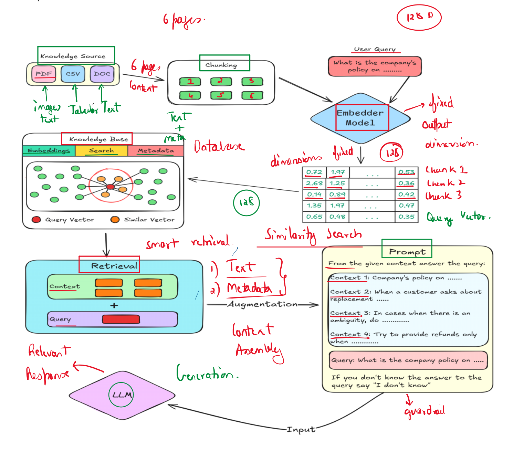

### What is RAG?
Retrieval-Augmented Generation

It is an AI architecture where:

Relevant information is retrieved from external knowledge sources
The retrieved information is provided to the LLM
The LLM generates an accurate contextual response 

RAG = Retrieval + LLM Generation

Instead of asking the LLM to answer from memory, we first give it relevant context.

Traditional LLM

User Question → LLM → Answer

Problem:

Depends only on trained knowledge   
RAG System

User Question → Retrieve Documents → Send Context to LLM → Generate Answer

Now the answer becomes:

✅ More accurate ✅ More contextual ✅ More reliable

                ┌───────────────────┐
                │   User Question   │
                └─────────┬─────────┘
                          │
                          ▼
                ┌───────────────────┐
                │   Retriever       │
                │ (Find Relevant    │
                │   Documents)      │
                └─────────┬─────────┘
                          │
                          ▼
                ┌───────────────────┐
                │ Knowledge Base    │
                │ PDFs, DB, Docs    │
                └─────────┬─────────┘
                          │
                          ▼
                ┌───────────────────┐
                │ Retrieved Context │
                └─────────┬─────────┘
                          │
                          ▼
                ┌───────────────────┐
                │       LLM         │
                │ Generates Answer  │
                └─────────┬─────────┘
                          │
                          ▼
                ┌───────────────────┐
                │ Final Response    │
                └───────────────────┘

Core Components of RAG

A RAG system mainly contains:

Component	Purpose
Knowledge Source	Stores documents/data
Embedding Model	Converts text into vectors
Vector Database	Stores embeddings
Retriever	Finds relevant documents
LLM	Generates final answer
Prompt Builder	Combines query + context

#### Knowledge Source
What is a Knowledge Source in RAG?

A Knowledge Source is the external data repository from which the Retriever fetches information and provides it to the LLM during inference.

This contains:
1. Unstructured Data ✅
   
Data with no fixed schema.

Examples:

PDFs
Word documents (.docx)

2. Semi-Structured Data ✅

Data has some structure but is not fully relational.

Examples:

JSON
XML
3. Structured Data ✅

Data stored in rows and columns.

Examples:

SQL databases
MySQL
PostgreSQL 

4. Source Code Repositories ✅

RAG can work with codebases.

Examples:

Python files
Java files
C++ files
GitHub repositories

#### Embedding Model

LLMs cannot directly search text efficiently.

So text is converted into vectors.

What is an Embedding?

Embedding = Numerical representation of text.

Example:

"Machine Learning" → [0.23, -0.98, 0.55, ...]

Texts with similar meaning have similar vectors.

##### Why embeddings are needed?

Because computers understand numbers better than raw language.

Embeddings help in:

✅ Semantic search ✅ Similarity matching ✅ Context retrieval 

#### Vector Database

The embeddings are stored inside vector databases.

Popular Vector Databases:

Pinecone
FAISS
ChromaDB
Weaviate
Milvus

Purpose:

Efficient similarity search.

#### Retriever

The retriever searches the vector database.

It finds:

Most relevant chunks
Semantically similar content

Example:

Question:

“What is company leave policy?”

Retriever searches embeddings and fetches:

HR policy section
Leave document paragraph

#### LLM (Generator)

The LLM receives:

User question
Retrieved documents

Then generates the final answer.

### How RAG Works (Step-by-Step)
#### STEP 1 — Data Collection

Documents are collected from:

PDFs
Websites
Databases
APIs
Enterprise systems

#### STEP 2 — Document Chunking

Large documents are split into smaller pieces called chunks.

Why?

Because:

LLM context window is limited
Smaller chunks improve retrieval accuracy

Example:

A 100-page PDF may be split into:

500-word chunks
1000-token chunks
Chunking Example
Full PDF
   ↓
Chunk 1
Chunk 2
Chunk 3
Chunk 4

#### STEP 3 — Generate Embeddings

Each chunk is converted into vector embeddings.

Chunk → Embedding Vector 

#### STEP 4 — Store in Vector Database

The vectors are stored in:

Pinecone
FAISS
ChromaDB etc.

#### STEP 5 — User Query

User asks:

“How many paid leaves are allowed?”

#### STEP 6 — Query Embedding

The user question is also converted into embeddings.

#### STEP 7 — Similarity Search

Retriever compares:

Question embedding vs Stored document embeddings

Then retrieves top relevant chunks.

#### STEP 8 — Context Injection

Retrieved chunks are added to prompt.

Example:

Context:
Employees get 24 paid leaves annually.

Question:
How many paid leaves are allowed?
#### STEP 9 — LLM Generates Answer

LLM generates grounded response.

Example:

Employees are allowed 24 paid leaves annually according to the HR policy.

#### Complete RAG Workflow Diagram
             ┌──────────────────┐
             │ Company Documents│
             └────────┬─────────┘
                      │
                      ▼
             ┌──────────────────┐
             │   Chunking       │
             └────────┬─────────┘
                      │
                      ▼
             ┌──────────────────┐
             │ Embedding Model  │
             └────────┬─────────┘
                      │
                      ▼
             ┌──────────────────┐
             │ Vector Database  │
             └────────┬─────────┘
                      ▲
                      │
          User Query  │
               │      │
               ▼      │
      ┌────────────────────┐
      │ Query Embedding    │
      └─────────┬──────────┘
                │
                ▼
      ┌────────────────────┐
      │ Similarity Search  │
      └─────────┬──────────┘
                │
                ▼
      ┌────────────────────┐
      │ Relevant Chunks    │
      └─────────┬──────────┘
                │
                ▼
      ┌────────────────────┐
      │ LLM Generation     │
      └─────────┬──────────┘
                │
                ▼
      ┌────────────────────┐
      │ Final Answer       │
      └────────────────────┘ 

### Real-World Examples of RAG 
#### Example 1 — Customer Support Chatbot

Company: E-commerce platform.

Data:

Refund policy
Shipping policy
Product manuals

User asks:

“How can I return my product?”

RAG retrieves:

Return policy document

LLM generates accurate response.
#### Example 2 — Healthcare Assistant

Data:

Medical journals
Treatment guidelines
Drug manuals

Doctor asks:

“What is the latest hypertension treatment?”

RAG retrieves latest medical documents.

#### Example 3 — Banking Assistant

Data:

Loan policies
Interest rates
KYC rules

Customer asks:

“What documents are required for home loan

### RAG Failures

#### 1. Retriever Failure
What is it?

Retriever fails to fetch the correct or relevant information from the knowledge source.

The required information exists in the database, but the retriever cannot find or return it.

Example

Knowledge Base contains:

The capital of Australia is Canberra.

User asks:

What is the capital of Australia?

Retriever returns:

Sydney is the largest city in Australia.

The correct document was available but not retrieved.

This is a Retriever Failure.

Reasons for Retriever Failure
Poor chunking
Bad embeddings
Weak similarity search
Ambiguous query
Incorrect metadata filtering
Low-quality vector search
Missing reranking
Result
Correct data exists
       +
Retriever misses it
       =
Retriever Failure

#### 2. Generator Failure
What is it?

Retriever successfully retrieves the correct information, but the LLM still generates an incorrect answer.

Example

Retrieved Context:

The capital of Australia is Canberra.

LLM Answer:

The capital of Australia is Sydney.

Retriever did its job correctly.

The LLM ignored or misunderstood the context.

This is a Generator Failure.

Reasons for Generator Failure
Hallucination
Weak prompt
Context misunderstanding
Long context confusion
Reasoning mistakes
LLM not properly grounded on retrieved documents
Result
Correct context retrieved
         +
Wrong answer generated
         =
Generator Failure

 