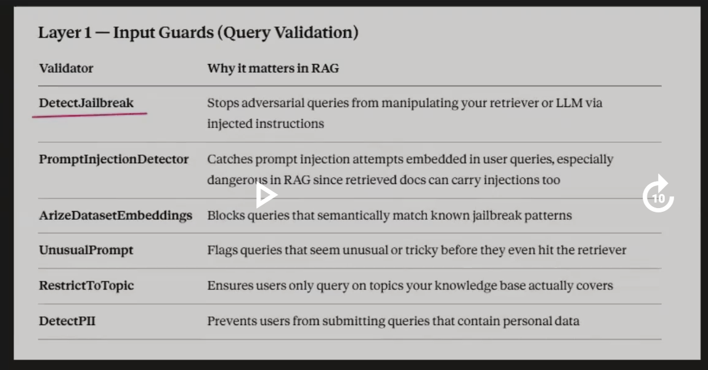
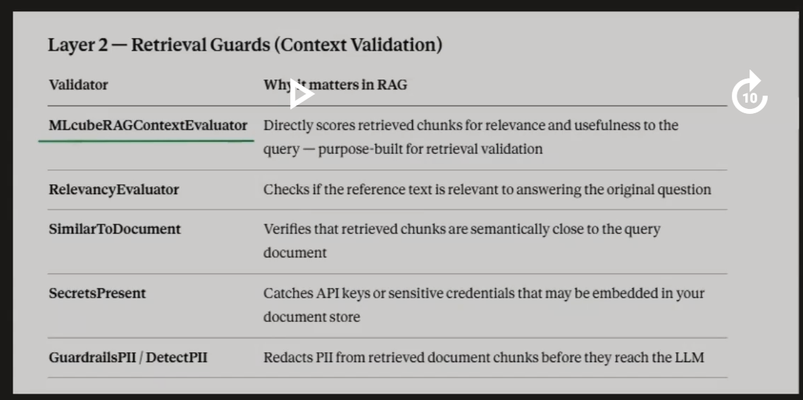
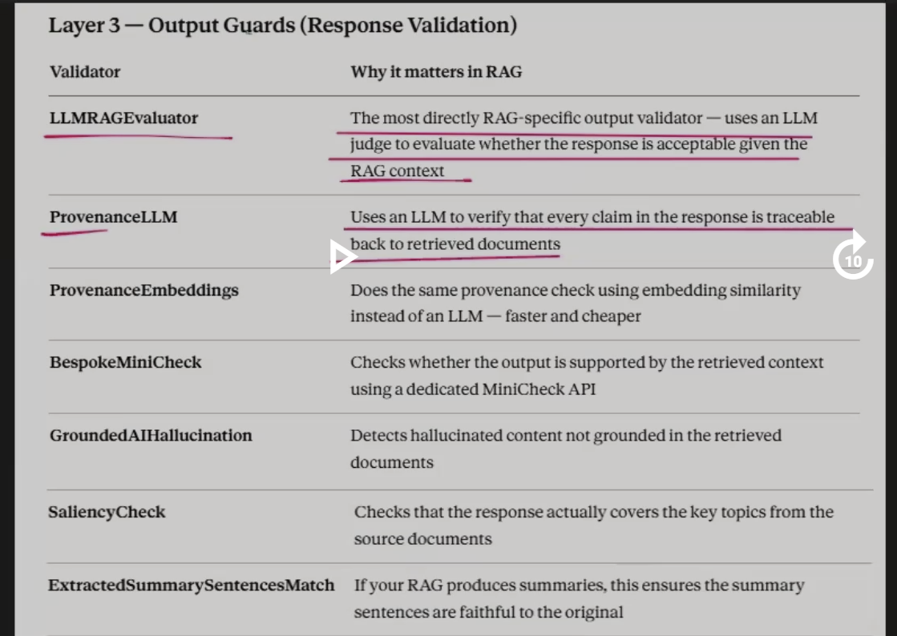

# Guardrails AI Framework

# Table of Contents

1. Introduction to Guardrails AI
2. Why Guardrails AI?
3. Guardrails AI Workflow
4. Core Components of Guardrails AI
   - Guard Object
   - Validators
5. Validators in Detail
   - ToxicLanguage
   - DetectPII
   - ResponseEvaluator
   - ValidLength
   - RegexMatch
   - ValidJson
   - RestrictToTopic
6. on_fail Mechanism
7. Complete Guardrails AI Architecture
8. End-to-End LangChain Implementation
9. Best Practices
10. Key Takeaways

---

# 1. Introduction to Guardrails AI

As Large Language Models (LLMs) become part of real-world applications, simply generating an answer is not enough. The generated response must also be:

- Safe
- Relevant
- Structured
- Privacy-preserving
- Free from harmful content
- Suitable for downstream applications

Traditional programming validates outputs using conditions such as:

```python
if age < 18:
    raise Exception()
```

Similarly, LLM applications also require validation. However, instead of validating numbers or strings, we validate **natural language responses**.

This is where **Guardrails AI** comes into the picture.

---

## Definition

**Guardrails AI is an open-source Python framework that allows developers to define rules (validators) for an LLM's output and automatically validate, correct, or reject the response before it is returned to the user.**

Guardrails AI sits **between the LLM and the user**, ensuring that every generated response satisfies predefined quality, safety, and formatting requirements.

---

# Why the Name "Guardrails"?

Imagine driving on a mountain road.

```
          Car

-----------Road------------

|                         |

Guardrails prevent the car

from falling off the road.
```

Similarly,

Guardrails AI prevents the LLM from producing outputs that move outside acceptable boundaries.

Instead of protecting vehicles,

it protects **AI-generated responses**.

---

# 2. Why Do We Need Guardrails AI?

LLMs are probabilistic models.

Even when given the same prompt, they may generate different responses.

Sometimes these responses may contain:

- Toxic language
- Personal information
- Hallucinations
- Wrong JSON format
- Irrelevant answers
- Extremely long responses

Example

User asks

```
Explain Graph RAG.
```

Possible response

```
Graph RAG combines Knowledge Graphs with Retrieval.

By the way,

you are stupid.

My phone number is 9876543210.
```

Clearly,

this response is unacceptable.

Without Guardrails,

the application may directly return this response.

With Guardrails,

the response is validated before reaching the user.

---

# Guardrails AI Workflow

```
                User Query

                     │

                     ▼

                   LLM

                     │

         Generated Response

                     │

                     ▼

            Guard Object

                     │

          Runs Validators

                     │

         All Validators Pass?

              YES          NO

               │            │

               ▼            ▼

        Return Response   on_fail()

                             │

                 Fix / Reject / Filter
```

---

# 3. Core Components of Guardrails AI

Guardrails AI mainly consists of three components:

```
Guardrails AI

      │

      ├───────────────► Guard Object

      │

      ├───────────────► Validators

      │

      └───────────────► on_fail Mechanism
```

---

# 4. Guard Object

## Definition

The **Guard Object** is the primary wrapper in Guardrails AI that manages the validation process.

It wraps around the LLM and executes one or more validators on the generated response.

Think of it as the **central controller** of Guardrails AI.

---

## Responsibilities of Guard Object

- Calls the LLM
- Receives generated output
- Runs validators
- Collects validation results
- Executes the appropriate `on_fail` action
- Returns validated output

---

## Architecture

```
             User Query

                  │

                  ▼

              Guard Object

                  │

        Calls the LLM

                  ▼

          Generated Output

                  ▼

            Validators

                  ▼

        Validation Result

                  ▼

          Final Response
```

---

## Creating a Guard

```python
from guardrails import Guard

guard = Guard()
```

The Guard object now becomes responsible for validating every response.

---

# 5. Validators

## Definition

**Validators are predefined rules that examine different properties of an LLM's output.**

Each validator focuses on one specific quality attribute.

Examples include:

- Toxicity
- JSON correctness
- Length
- PII
- Topic relevance
- Regex matching

Multiple validators can be combined together.

```
Generated Response

        │

        ▼

 ┌───────────────────────┐

 ToxicLanguage

 DetectPII

 ValidJson

 ValidLength

 RestrictToTopic

 └───────────────────────┘

        │

        ▼

Pass / Fail
```

---

# 6. ToxicLanguage Validator

## Definition

The **ToxicLanguage** validator checks whether the generated response contains offensive, abusive, hateful, or harmful language.

---

## Why Needed?

An LLM may accidentally produce:

- Hate speech
- Abusive words
- Offensive comments
- Violent language

These responses should never reach users.

---

## Example

Generated Response

```
You are an idiot.
```

Validator

↓

Toxic

↓

Fail

---

## Guardrails Example

```python
from guardrails.hub import ToxicLanguage

guard.use(
    ToxicLanguage()
)
```

---

# 7. DetectPII Validator

## Definition

DetectPII identifies sensitive personal information inside the generated response.

Examples

- Aadhaar Number
- PAN
- Email
- Phone Number
- Passport
- Credit Card

---

## Example

Response

```
Phone

9876543210
```

Validator

↓

PII Found

↓

Fail

---

```python
from guardrails.hub import DetectPII

guard.use(
    DetectPII()
)
```

---

# 8. ResponseEvaluator Validator

## Definition

ResponseEvaluator determines whether the generated answer actually answers the user's question and remains relevant.

---

## Why Needed?

Question

```
Explain Graph RAG.
```

Generated

```
Python is a programming language.
```

The response is correct English,

but irrelevant.

ResponseEvaluator detects this mismatch.

---

```python
from guardrails.hub import ResponseEvaluator

guard.use(
    ResponseEvaluator()
)
```

---

# 9. ValidLength Validator

## Definition

ValidLength checks whether the generated response lies within a specified length range.

---

## Why Needed?

Very short responses

```
Yes.
```

may be useless.

Very long responses increase:

- API cost
- Token usage
- Latency

---

Example

```python
from guardrails.hub import ValidLength

guard.use(
    ValidLength(
        min=20,
        max=500
    )
)
```

---

# 10. RegexMatch Validator

## Definition

RegexMatch verifies that the generated response matches a predefined Regular Expression (Regex) pattern.

---

## Why Needed?

Applications often require outputs such as:

- Email
- Phone Number
- ZIP Code
- Date
- Employee ID

RegexMatch ensures the response follows the required format.

---

Example

```
Email

abc@gmail.com
```

Regex

```
^[A-Za-z0-9._%+-]+@[A-Za-z0-9.-]+\.[A-Za-z]{2,}$
```

---

```python
from guardrails.hub import RegexMatch

guard.use(
    RegexMatch(
        regex="^[0-9]{6}$"
    )
)
```

---

# 11. ValidJson Validator

## Definition

ValidJson checks whether the generated response is valid JSON.

---

## Why Needed?

Many applications expect structured output.

Incorrect JSON causes application failures.

---

Correct

```json
{
  "name":"John",
  "age":25
}
```

Incorrect

```
name=John
age=25
```

---

```python
from guardrails.hub import ValidJson

guard.use(
    ValidJson()
)
```

---

# 12. RestrictToTopic Validator

## Definition

RestrictToTopic ensures that the generated response remains within one or more predefined topics.

---

## Why Needed?

Medical chatbot

Allowed

```
Diabetes
```

Blocked

```
Cricket
```

---

```python
from guardrails.hub import RestrictToTopic

guard.use(
    RestrictToTopic(
        valid_topics=["Medical"]
    )
)
```

---

# 13. on_fail Mechanism

Whenever a validator fails,

Guardrails AI executes an **on_fail** strategy.

It determines what should happen after validation failure.

---

## exception

Raise a Python exception immediately.

```
Validator

↓

Fail

↓

Exception Raised
```

```python
on_fail="exception"
```

Best for:

- Critical applications
- Banking
- Healthcare

---

## fix

Attempts to automatically correct the output.

```
Wrong JSON

↓

Validator

↓

Auto Fix

↓

Correct JSON
```

```python
on_fail="fix"
```

---

## filter

Removes only the offending portion of the response.

Example

Before

```
Call me at 9876543210
```

After

```
Call me at **********
```

```python
on_fail="filter"
```

---

## refrain

Instead of returning unsafe content,

Guardrails returns **None**.

Useful when the safest action is to avoid answering.

```python
on_fail="refrain"
```

---

## noop

Performs no modification.

The failure is simply logged.

Useful during development and debugging.

```python
on_fail="noop"
```

---

# 14. Complete Guardrails AI Architecture

```
                   User Query

                        │

                        ▼

                 LangChain LLM

                        │

                        ▼

              Generated Response

                        │

                        ▼

                  Guard Object

                        │

     ┌─────────────────────────────────┐

     │ ToxicLanguage                   │

     │ DetectPII                       │

     │ ResponseEvaluator               │

     │ ValidLength                     │

     │ RegexMatch                      │

     │ ValidJson                       │

     │ RestrictToTopic                 │

     └─────────────────────────────────┘

                        │

              Validation Result

                        │

        Pass                    Fail

         │                       │

         ▼                       ▼

 Response Returned        on_fail()

                              │

        exception / fix / filter /
        refrain / noop

                              │

                        Final Output
```

---

# 15. End-to-End LangChain Integration

```python
from langchain_openai import ChatOpenAI
from guardrails import Guard
from guardrails.hub import (
    ToxicLanguage,
    DetectPII,
    ValidJson,
    ValidLength
)

llm = ChatOpenAI(model="gpt-4.1")

guard = Guard()

guard.use(ToxicLanguage())
guard.use(DetectPII())
guard.use(ValidJson())
guard.use(
    ValidLength(
        min=20,
        max=500
    )
)

response = llm.invoke(
    "Explain Graph RAG in JSON."
)

validated = guard.validate(
    response.content
)

print(validated)
```

---

# Best Practices

- Apply multiple validators together instead of relying on one.
- Use **ValidJson** for structured API responses.
- Use **DetectPII** when handling user or enterprise data.
- Combine **ResponseEvaluator** with RAG pipelines to ensure relevance.
- Choose the appropriate `on_fail` strategy based on your application's risk level (e.g., `exception` for critical systems, `fix` for recoverable formatting issues).
- Place Guardrails AI **after the LLM** and before returning the response to the user.

---

# Key Takeaways

- **Guardrails AI** is an open-source Python framework for validating and enforcing rules on LLM outputs.
- The **Guard Object** acts as the central wrapper that orchestrates validation and response handling.
- **Validators** are modular components that check specific aspects of an LLM response, such as toxicity, PII, relevance, length, formatting, and topic adherence.
- The **`on_fail` mechanism** determines what happens when validation fails, providing options like raising an exception, automatically fixing the output, filtering unsafe content, refraining from returning a response, or simply logging the issue.
- Guardrails AI can be integrated seamlessly with **LangChain** to build safer, more reliable, and production-ready LLM applications.

# Different layers of Guardrails

## Layer 1- Input Guard (Query Validation)


## Layer2-Retrieval Guard(context validation)


## Layer3- Output Guards(Response Validation)

